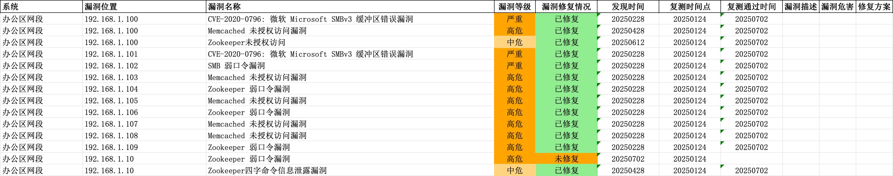
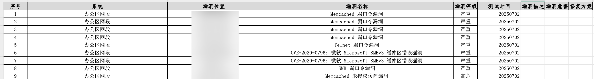
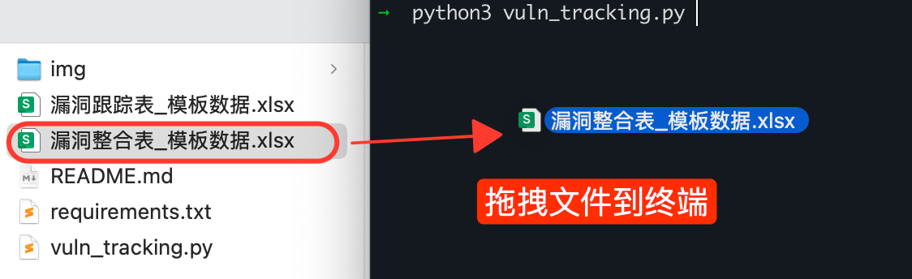

# vuln_tracking

---

本项目旨在自动化跟踪管理历史漏洞，可以根据历史的漏洞数据（需要包含指定数据）来生成漏洞跟踪表。

## 生成效果

这里由于模板数据中没有相关数据，所以会有缺失。



## 漏洞数据整合

将历史报告的报表数据整合到一个excel整合表中，并补充测试时间，表格样式随意但表头需严格按照模板设定，也可以留空；

数据字段：

```
序号
系统
漏洞位置
漏洞名称
漏洞等級
测试时间
漏洞描述漏洞危害修复方案
```



## 生成漏洞跟踪

### 脚本使用

```shell
# 安装依赖
pip3 install -r requirements.txt
# 执行
python3 vuln_tracking.py your_input_file_path  you_output_file_path
```




## Q&A


Q1：对于只扫描了部分资产的情况下如何更新？（修复判定是根据最后一次扫描的修复状态，**最后一次没有出现的漏洞则会判定为修复**）

A1：好像没有很好的办法，目前只能

1.   在漏洞台账（整合表）中挑选出本次扫描的资产到新表中，再补充本次扫描结果，运行脚本得到这**部分资产的更新情况**；
2.   在部分更新时在总表中备注“部分更新”，攒够一次全量更新后统一刷新成最后部分更新的时间，再统一更新一次。
